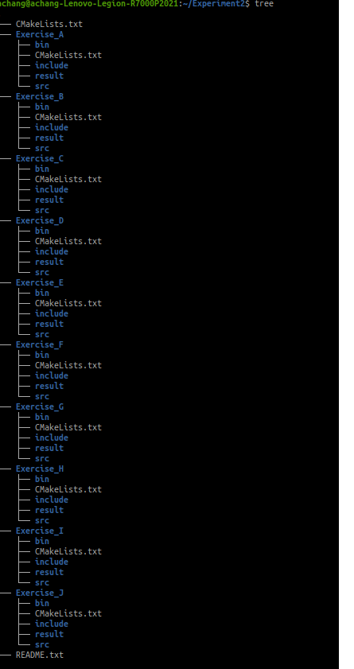

<h1> <center>TEST WORK</center> </h1>

> Author: Achang
> Version: 1.0
> Update time: 2024.10.31

 <h2> <center><span style="color:orange;"> 
 👉⚠️友情提示：前方高能⚠️👈  
 </span></center></h2>

> *   <font face="楷体"> 为了将任务保持连贯性我们今后的实验都会采用英文的方式进行描述</font>
> *   <font face="楷体">没错作者也想要挑战一下自己锻炼一下英语能力，没错又是连贯性</font>
> *   <font face="楷体"> ~~（放心啦肯定会很友好的）~~  </font>
> *   <font face="楷体">~~这可能是你们能看到的最后一次中文描述~~</font>
> *   <font face="楷体">本次任务你需要创建一个工程主目录 **Experiment2** </font>
> *   <font face="楷体">工程主目录 **Experiment2** 下包含 **Exercise\_A** 、**Exercise\_B** 、 ... 、**Exercise\_J** 、**README.md** </font>


***

## **<h3><center><span style="color:Blue;">Fake it until you make it 😏 </span></center></h3>**

> *   <span style="color:#55DBE6;">Fristly, there are some rules for study the major which named Computer Science And Technology.
> *   <span style="color:#49BCC4;">I firmly believe that, if you can follow this approach, it will offer the power to make you truly stand out.
> *   <span style="color:#399299;">So one thing can be certain: I want you to understand that the world always follows the law of energy conservation, and there is no magic in Computer Science.
> *   <span style="color:#153638;">Ultimately, I hope that you can keep yourself and possess an unyeilding resolve in the face of adversity, while becoming an "outsider" in your environment.
> *   <span style="color:#0A181A;">So let's do it.




***

## <span style="color:gray;">  SECTION ONE:</span>⭐

### Complete this task by reading the materials, which have been provided

> ### TO DO:
>
> *   In this section, you will create a project which named  **==Exercise_A==**
> *   This project includes floders such as src and include. You should write the program using C language and \*\*place it in the folder named \*\****src***.
> *   Create a header file, \*\*put in the floder named \*\****include***.

<h1><center>算了不拷打你们了😏</center></h1>


> ### TO DO:
>
> *   在这个部分你需要创建一个工程文件夹 **Exercise_A**
>
> *   在这个文件夹中包括有名为src、include,你需要使用C语言编写源文件 **并且将它放入*****src*****文件中**
>
> *   创建~~一个~~（或者一些？）头文件**将他们放进*****include*****文件夹中**
>
> *   你需要完成以下任务（程序要求）：
>
> > 1.创建由 **int** 类型构成的数组长度为10
> > 2.在头文件中编写一个函数对数组中的元素进行排序
> > 3.在头文件中编写一个函数对数组的元素进行输出
>
> *   **输入样例：**
>
> > 1 10 60 50 20 30 22 31 15 44
> > (或者自己定义10个数也是可以的)
>
> *   **输出样例：**
>
> > 1 10 15 20 22 30 31 44 50 60

> ### FORM OF SUBMISSION:
>
> *   <span style="color:#399299;">将输出结果写入**result\_1.txt**文件中,该文件存放的位置应位于 **Experiment2/Exercise\_A/result/** 目录下</span>
> *   <span style="color:#399299;">截图输出结果并且放入**README.md文件**中,该文件位于 **Experiment2/** 之下</span>
> *   <span style="color:#399299;">将二进制文件**安装在Experiment2/Exercise\_A/bin文件夹中**</span>
> *   示例目录
>
> ```
> achang@achang-Lenovo-Legion-R7000P2021:~/Experiment2/Exercise_A$ tree
> .
> ├── bin
> ├── CMakeLists.txt
> ├── include
> ├── result
> └── src
>
> ```

## <span style="color:gray;">  SECTION TWO: </span>⭐⭐

### Complete this task by reading the materials, which have been provided

> ### DESCRIBE:
>
> *   输入两个整数 N和M，构造一个 N 行 M 列的数字矩阵，矩阵中的数字从第一行到最后一行，按从左到右的顺序依次为 1,2,3,…,N×M.
>     矩阵构造完成后，将每行的最后一个数字变为 PUM, 输出最终矩阵

> ### TO DO:
>
> *   **输入格式：** 共一行，包含两个整数 N 和 M
> *   **输出格式：** 输出最终矩阵，具体形式参照输出样例

> *   **输入样例：**
>
>
>
>      7 4

> *   **输出样例：** 输出最终矩阵，具体形式参照输出样例
>
>
>
>     1 2 3 PUM
>     5 6 7 PUM
>     9 10 11 PUM
>     13 14 15 PUM
>     17 18 19 PUM
>     21 22 23 PUM
>     25 26 27 PUM

> ### FORM OF SUBMISSION:

> *   <span style="color:#399299;">将输出结果写入**result\_2.txt**文件中,该文件存放的位置应位于 **Experiment2/Exercise\_B/result/** 目录下</span>
> *   <span style="color:#399299;">截图输出结果并且放入**README.md文件**中,该文件位于 **Experiment2/** 之下</span>
> *   <span style="color:#399299;">将二进制文件**安装在Experiment2/Exercise\_B/bin文件夹中**</span>

## <span style="color:gray;">  SECTION THREE: </span>⭐⭐

### Complete this task by reading the materials, which have been provided

> ### DESCRIBE:
>
> *   给定一个长度为 n的数组 a，你需要编写一个函数
>     `int get_unique_count(int a[], int n);  // 返回数组前n个数中的不同数的个数`
>
> ### TO DO:
>
> *   **输入格式：** 第一行包含一个整数 n 第二行包含 n 个整数，表示数组 a
> *   **输出格式：** 共一行，包含一个整数表示数组中不同数的个数
> *   **数据范围：** **1 ≤ n ≤ 1000 ; 1 ≤ a<sub>i</sub> ≤ 1000**

> *   **输入样例：**
>
> <!---->
>
>     5
>     1 1 2 4 5
>
> *   **输出样例：**
>
> <!---->
>
>     4

> ### FORM OF SUBMISSION:

> *   <span style="color:#399299;">将输出结果写入**result\_3.txt**文件中,该文件存放的位置应位于 **Experiment2/Exercise\_C/result/** 目录下</span>
> *   <span style="color:#399299;">截图输出结果并且放入**README.md文件**中,该文件位于 **Experiment2/** 之下</span>
> *   <span style="color:#399299;">将二进制文件**安装在Experiment2/Exercise\_C/bin文件夹中**</span>

## <span style="color:gray;">  SECTION FOUR: </span>⭐⭐

### Complete this task by reading the materials, which have been provided

> ### DESCRIBE:
>
> *   Struct 是一种数据结构，它允许你将多个不同类型的数据项目组合成一个单一的类型，这些数据项称为结构体的成员（members），它们可以是任何数据类型，包括基本数据类型（如int、float、char等）和复合数据类型（如数组、指针、甚至是其他结构体）。
> *   我们来举一个 ~~（简单的）~~ 例子
>
> ```C
> struct drink
> {
>   int id; //属性 drink的id号
>   char name[]; //属性 drink的名称
>   float price; //属性 drink的价格
> };
> ```
>
> *   创建对象以及给字符数组赋值办法
>
> ```C
> #include <stdio.h>
> #include <string.h>
> struct drink
> {
> 	int id;
> 	char name[];
> };
>
> int main()
> {
> 	struct drink colo; //创建一个实例对象
> 	colo.id = 11111;
> 	strcpy(colo.name, "peishi"); //将pershi赋值给colo这个实例对象的属性name
> }
> ```

> ### TO DO:
>
> *   尝试创建一个头文件object.h
>
> ```c
> #ifndef __OBJECT_H__
> #define __OBJECT_H__
> struct drink
> {
>  	int id;
>  	char name[];
> };
> #endif
> ```

> *   尝试创建一个头文件main.c
>
> ```c
> #include <stdio.h>
> #include <string.h>
> int main()
> {
>  struct drink colo; //创建一个实例对象
>  colo.id = 11111;
>  strcpy(colo.name, "peishi"); //将pershi赋值给colo这个实例对象的属性name, 这个函数封装在string.h中数以必须在开头引入它
>  return 0;
> }
> ```

> ### FORM OF SUBMISSION:

> *   <span style="color:#399299;">~~将输出结果写入~~**~~result\_4.txt~~**~~文件中,该文件存放的位置应位于 ~~**~~Experiment2/Exercise\_D/result/~~**~~ 目录下~~</span>
> *   <span style="color:#399299;">截图输出结果并且放入**README.md文件**中,该文件位于 **Experiment2/** 之下</span>
> *   <span style="color:#399299;">将二进制文件**安装在Experiment2/Exercise\_D/bin文件夹中**</span>
---
我们的提交方式这一次发生了一些~~细微的~~变化
你需要：
    1. 在github上创建一个仓库然后将你的工程打包上传
    2. 同时需要在群内上传你的Markdown文件（Experiment/README.txt）
    
<center>

<H2>
<span style="color:#399299;">友情提示：你已经过了新手村啦，要学会仔细分析问题rather than🤳💻
</H2>

<H2>
<span style="color:#399299;">没有时间哀悼，接下来登场的是
</H2>
<h1>
<span style="color:#ae180f;">
👿HARD MODE👿</h1> 
</span>
</center>
